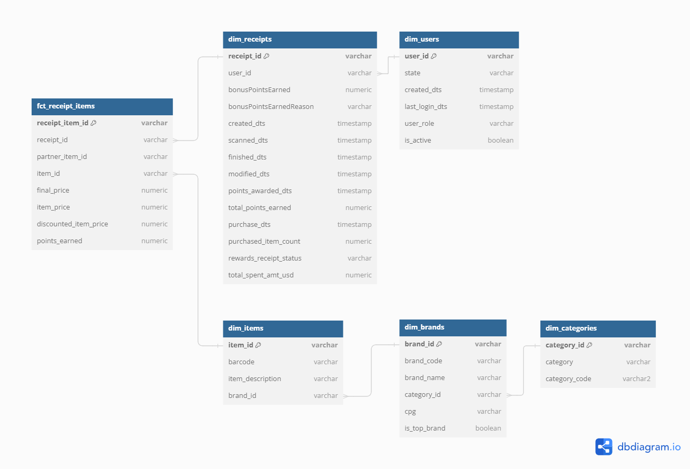

# Fetch Rewards Analytics Engineering Exercise

This is my attempt to model the data provided in the exercise. 
I've included some general thoughts below on some design choices/philosophy as well as my answers to the questions.
There are quite a few choices here that I would make differently if this were an actual work project; I've skipped quite a few steps in proper design (e.g. creating a catch-all for natural keys that don't exist in their dimensions.)

## General Thoughts

### Warnings versus Errors
In my opinion, errors should be for true code issues (something that a developer _can_ fix) and warnings should be for data issues (something that a developer _cannot_ fix). 
In a production setting we'd move true data issues into another tool/platform (e.g. Monte Carlo) to manage to avoid flooding devs with too many failing issues.
I've included all of the data quality issues as warnings and set errors only for major issues (e.g. referential integrity, uniqueness) on the `marts` layer.

### Camelcase versus Snakecase, and other naming conventions
The original data came as camelCase but Snowflake works better with identifiers that are snake_cased. I've rewritten table and column names as such. 
I've also renamed some fields to more accurately describe what kind of data they are (e.g. timestamps that were described as dates).

### Performance
Almost everything would normally be built using incremental models; larger models would be clustered as well. Since we don't have an actual loading mechanism and there are no load dates, I'm not going to bother building this out with incremental models. 

## Answers

### Q1: Data Model

### Q2: SQL Queries
See queries in semantic layer: [here](models/semantic/)

### Q3: Data Quality
All data quality tests are set up as dbt tests. 

At a high level:
- There are referential integrity issues between brands and receipts. 
- There are duplicate users.
- There are a lot of nulls where there shouldn't be.
- There is data that defies business logic. 
- There are items that do not sum up to their totals.